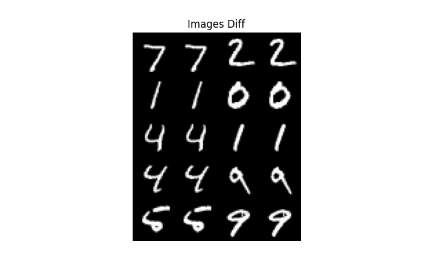

# AE tutorial

Trained AE model by cifar10.

Compared to the original implementation, we have added batchnorm and changed the compression dimension.

paper

> <https://arxiv.org/abs/2201.03898>

## FAA

Feed-forward architecture

### MNIST

```txt
epoch: 189
test_loss          0.010081866756081581
```


### CIFAR10

```txt
epoch: 48
test_loss           0.03823928162455559
```


## CA

Convolutional auto encoder architecture

### MNIST

```txt
epoch: 68
test_loss          4.327146598370746e-05
```




### CIFAR10

```txt
epoch:
epoch: 86
test_loss          0.001922393450513482
```


## Usage

If you test this script, please remove below in Dockerfile.

```Dockerfile
WORKDIR /root
COPY setup_vim/ ./setup_vim/
RUN ./setup_vim/neovim/scripts/install_dependencies_root.sh && \
    ./setup_vim/neovim/scripts/install_dependencies_user.sh
```

```sh
git clone $REPO_URL
cd ae_tutorial
cp .env.sample .env
# Specify your environments
vi .env
docker compose build
docker compose up -d
docker compose exec app sh
./train.sh
docker compose down
```
